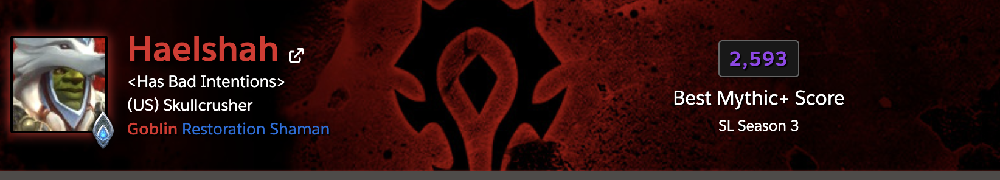
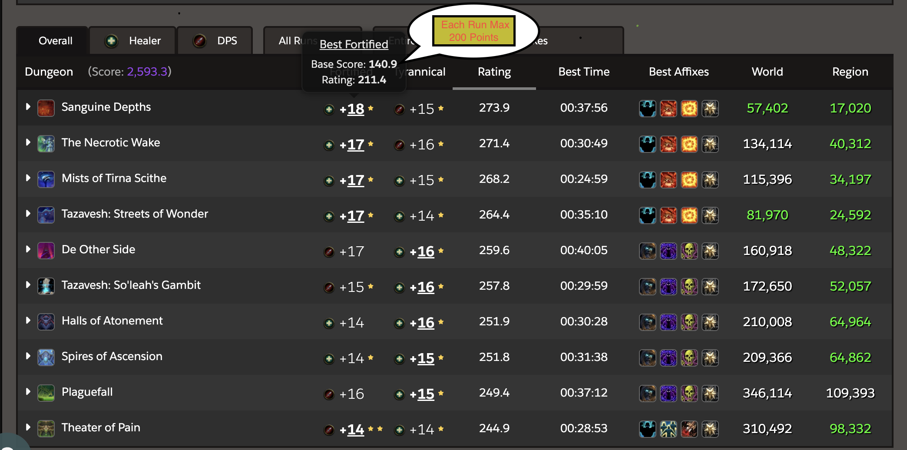
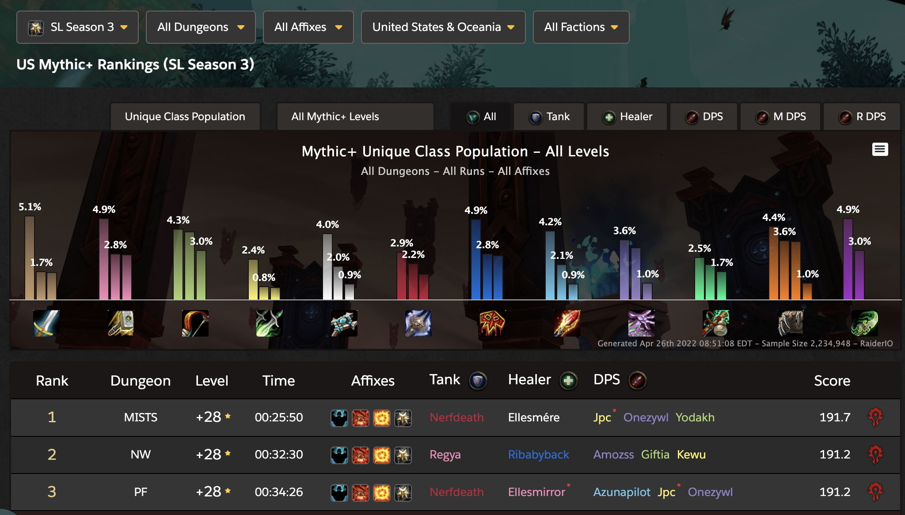

# World Of Warcraft Rankings

World of Warcraft(WOW) rankings provides an overview of achievemnts in a given season by displaying **live** progress of players in 2 ways, _Dungeon(5-man team)_ and _Raid(20-man Team)_ content in the game. In addition we can search for a particular character and find more specific information about that is pertinent in determining if you are 'good' for recruitement or not. score in 5-man team timed dungeons and current progression on Mythic(hardest difficulty) 20-man team which is calculated boss count defeated(out of 11 this season).In addition, you can type in a name of a live character and get the individual performance.

## Feature 1- Individual Character Search

As mentioned above, the first feature will be an indivudal character search that will display live dynamic(live) information such as individual RIO Score, top 10 highest scoring dungeons, and current progression in 20-man.

### 1A- Dungeon(5-man team) & the individual 'RIO' score:

This score is calculated with the following rules below:

1. Completing a run within the time limit.
2. Completing each dungeon(currently 10 active).
3. Completing each variation of the dungeon(2 per.)
4. Max Score of 200 points per variation with overall total being 4000 points.

### 1B- Raid Progression(20-man team)

This is Calculated by:

1. Number of Bosses Defeated(out of 11 this season)
2. Level of difficulty (N(Normal)=Easy,H(Heroic)=Medium,M(Mythic)=Hard)

_Below is an example of what a overall score, current raid progression, and character search looks like and how its laid out in JSON._


```javascript
{
  "name": "Fourscoops",
  "race": "Goblin",
  "class": "Priest",
  "active_spec_name": "Shadow",
  "active_spec_role": "DPS",
  "gender": "female",
  "faction": "horde",
  "achievement_points": 9510,
  "honorable_kills": 0,
  "thumbnail_url": "https://render-us.worldofwarcraft.com/character/firetree/193/172321473-avatar.jpg?alt=wow/static/images/2d/avatar/9-1.jpg",
  "region": "us",
  "realm": "Firetree",
  "last_crawled_at": "2022-04-25T04:50:14.000Z",
  "profile_url": "https://raider.io/characters/us/firetree/Fourscoops",
  "profile_banner": "hordebanner1",
  "mythic_plus_scores_by_season": [
    {
      "season": "season-sl-3",
      "scores": {
        "all": 2513,
        "dps": 1607.6,
        "healer": 2313.6,
        "tank": 0,
        "spec_0": 0,
        "spec_1": 2313.6,
        "spec_2": 1607.6,
        "spec_3": 0
      },
      "segments": {
        "all": {
          "score": 2513,
          "color": "#8e4aea"
        },
        "dps": {
          "score": 1607.6,
          "color": "#5699b2"
        },
        "healer": {
          "score": 2313.6,
          "color": "#6062e3"
        },
        "tank": {
          "score": 0,
          "color": "#ffffff"
        },
        "spec_0": {
          "score": 0,
          "color": "#ffffff"
        },
        "spec_1": {
          "score": 2313.6,
          "color": "#6062e3"
        },
        "spec_2": {
          "score": 1607.6,
          "color": "#5699b2"
        },
        "spec_3": {
          "score": 0,
          "color": "#ffffff"
        }
      }
    }
  ]
}

```

### Feature 2 - Top 10 Highest Scoring 5-Man team dungeons for individual.

Live information of Season to date in highest scoring dungeons integrated by character search.

_Below is an example of what individual score looks like and JSON layout._


```javascript
{
  "name": "Haelshah",
  "race": "Goblin",
  "class": "Shaman",
  "active_spec_name": "Restoration",
  "active_spec_role": "HEALING",
  "gender": "male",
  "faction": "horde",
  "achievement_points": 9510,
  "honorable_kills": 0,
  "thumbnail_url": "https://render-us.worldofwarcraft.com/character/skullcrusher/247/230620663-avatar.jpg?alt=wow/static/images/2d/avatar/9-0.jpg",
  "region": "us",
  "realm": "Skullcrusher",
  "last_crawled_at": "2022-04-26T04:01:51.000Z",
  "profile_url": "https://raider.io/characters/us/skullcrusher/Haelshah",
  "profile_banner": "hordebanner1",
  "mythic_plus_best_runs": [
    {
      "dungeon": "Sanguine Depths",
      "short_name": "SD",
      "mythic_level": 18,
      "completed_at": "2022-04-24T04:06:15.000Z",
      "clear_time_ms": 2276133,
      "par_time_ms": 2460999,
      "num_keystone_upgrades": 1,
      "map_challenge_mode_id": 380,
      "zone_id": 12842,
      "score": 140.9,
      "affixes": [
        {
          "id": 10,
          "name": "Fortified",
          "description": "Non-boss enemies have 20% more health and inflict up to 30% increased damage.",
          "icon": "ability_toughness",
          "wowhead_url": "https://wowhead.com/affix=10"
        },
        {
          "id": 6,
          "name": "Raging",
          "description": "Non-boss enemies enrage at 30% health remaining, dealing 50% increased damage until defeated.",
          "icon": "ability_warrior_focusedrage",
          "wowhead_url": "https://wowhead.com/affix=6"
        },
        {
          "id": 13,
          "name": "Explosive",
          "description": "While in combat, enemies periodically summon Explosive Orbs that will detonate if not destroyed.",
          "icon": "spell_fire_felflamering_red",
          "wowhead_url": "https://wowhead.com/affix=13"
        },
        {
          "id": 130,
          "name": "Encrypted",
          "description": "Enemies throughout the dungeon possess relics of the First Ones. Destroy the relics to summon the First Ones' Automa and gain powerful bonuses, based on the order in which they were destroyed.",
          "icon": "spell_progenitor_orb",
          "wowhead_url": "https://wowhead.com/affix=130"
        }
      ],
      "url": "https://raider.io/mythic-plus-runs/season-sl-3/8019194-18-sanguine-depths"
    },

```

## Feature 3 - Top 20 highest scoring (5-man) dungeons by team.

Live data is pulled and updated daily to outline to highest scoring 5-man run in the season that was completed to date.



Below is a sample of what the JSON code will look like in finding the best runs to date.

```javascript
{
  "rankings": [
    {
      "rank": 21,
      "score": 187.3,
      "run": {
        "season": "season-sl-3",
        "dungeon": {
          "id": 12831,
          "name": "Halls of Atonement",
          "short_name": "HOA",
          "slug": "halls-of-atonement",
          "expansion_id": 8,
          "patch": "9.0.2",
          "keystone_timer_ms": 1920999
        },
        "keystone_run_id": 8082197,
        "keystone_team_id": 152377559,
        "keystone_platoon_id": null,
        "mythic_level": 27,
        "clear_time_ms": 1574089,
        "keystone_time_ms": 1920999,
        "completed_at": "2022-04-24T22:55:11.000Z",
        "num_chests": 1,
        "time_remaining_ms": 346910,
        "faction": "horde",
        "weekly_modifiers": [
          {
            "id": 10,
            "icon": "ability_toughness",
            "name": "Fortified",
            "description": "Non-boss enemies have 20% more health and inflict up to 30% increased damage."
          },
          {
            "id": 6,
            "icon": "ability_warrior_focusedrage",
            "name": "Raging",
            "description": "Non-boss enemies enrage at 30% health remaining, dealing 50% increased damage until defeated."
          },
          {
            "id": 13,
            "icon": "spell_fire_felflamering_red",
            "name": "Explosive",
            "description": "While in combat, enemies periodically summon Explosive Orbs that will detonate if not destroyed."
          },
          {
            "id": 130,
            "icon": "spell_progenitor_orb",
            "name": "Encrypted",
            "description": "Enemies throughout the dungeon possess relics of the First Ones. Destroy the relics to summon the First Ones' Automa and gain powerful bonuses, based on the order in which they were destroyed."
          }
        ],
        "num_modifiers_active": 4,
        "roster": [
          {
            "character": {
              "id": 41494687,
              "persona_id": 3351014,
              "name": "Nerfdeath",
              "class": {
                "id": 6,
                "name": "Death Knight",
                "slug": "death-knight"
              },
              "race": {
                "id": 10,
                "name": "Blood Elf",
                "slug": "blood-elf",
                "faction": "horde"
              },
              "faction": "horde",
              "level": 60,
              "spec": {
                "id": 250,
                "name": "Blood",
                "slug": "blood"
              },
              "path": "/characters/us/area-52/Nerfdeath",
              "realm": {
                "id": 264,
                "connectedRealmId": 136,
                "name": "Area 52",
                "altName": null,
                "slug": "area-52",
                "altSlug": "area-52",
                "locale": "en_US",
                "isConnected": false
              },
              "region": {
                "name": "United States & Oceania",
                "slug": "us",
                "short_name": "US"
              },
              "stream": null,
              "recruitmentProfiles": []
            },
            "oldCharacter": null,
            "isTransfer": false,
            "role": "tank"
          },
```

## Resource(s)

-**Raider IO(RIO) API**: Pulls Live and static information from the game servers. [RIO API](https://raider.io/api#/)

-**RIO Website**:Actual display of content etc. [RIO Website](https://raider.io/api#/)

https://worldofwarcraft.com/en-us/game/status/us realm list
